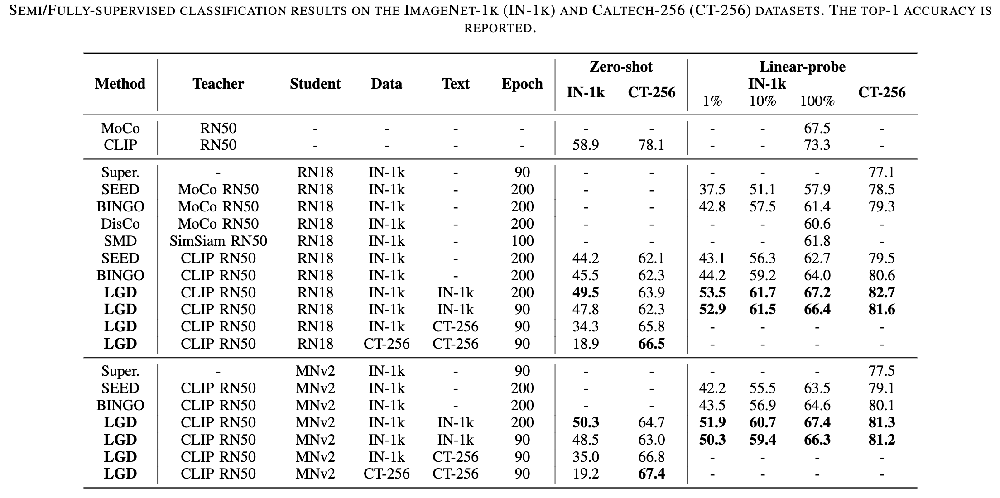

# Lightweight Model Pre-training via Language Guided Knowledge Distillation (T-MM 2024)


## 🏃 Intro LGD

<details open="open">
    <summary><b>Abstract</b></summary>

This paper studies the problem of pre-training for small models, which is essential for many mobile devices. Current state-of-the-art methods on this problem transfer the representational knowledge of a large network (as a Teacher) into a smaller model (as a Student) using self-supervised distillation, improving the performance of the small model on downstream tasks. However, existing approaches are insufficient in extracting the crucial knowledge that is useful for discerning categories in downstream tasks during the distillation process. In this paper, for the first time, we introduce language guidance to the distillation process and propose a new method named Language-Guided Distillation (LGD) system, which uses category names of the target downstream task to help refine the knowledge transferred between the teacher and student. %build a textual semantics bank (TSB) and visual semantics bank (VSB). To this end, we utilize a pre-trained text encoder to extract semantic embeddings from language and construct a textual semantic space called Textual Semantics Bank (TSB). Furthermore, we design a Language-Guided Knowledge Aggregation (LGKA) module to construct the visual semantic space, also named Visual Semantics Bank (VSB). The task-related knowledge is transferred by driving a student encoder to mimic the similarity score distribution inferred by a teacher over TSB and VSB. Compared with other small models obtained by either ImageNet pre-training or self-supervised distillation, experiment results show that the distilled lightweight model using the proposed LGD method presents state-of-the-art performance and is validated on various downstream tasks, including classification, detection, and segmentation.


</details>

## 🚩 News

- 2024-06. 💥 Code for [LGD]() is available now!

- 2024-06. 🎉 Our [LGD](), a new method for lightweight model pre-training, is accepted to T-MM 2024.



## ⚡ Set up
<details>
  <summary><b>Environment</b></summary> 

  ```shell
  bash scripts/requirement.sh
  ```
</details>


<details>
  <summary><b>Data</b></summary>


1. download dataset (ImageNet, CoCo, LVIS, Caltech...).
2. we provide some scripts for preparing datasets.

  ```shell
  # prepare Caltech-256
  python tools/make-caltech-trainval.py
  # make ImageNet subset
  python tools/make-imgnet-subset.py
  # get text prompt from dataset
  python get-caltech-classnames.py
  ```

</details>


<details>
  <summary><b>Download CLIP pre-trained weights</b></summary>

  ```shell
  cd clip/weights/
  bash download_clip_models.sh
  ```
</details>
  

## 💻 Training & Testing


To conduct the training on single Node using Distributed Training: 
```shell
bash scripts/train.sh
```

Conduct linear evaluations on ImageNet-val split:
```shell
bash scripts/lincls.sh
```

Conduct zero-shot classification on ImageNet-val split:
```shell
bash scripts/zscls.sh
```

Transfer to Detection (COCO 2017/LVIS v1):
```shell
# convert pretrained checkpoint to torchvision style
python tools/conver-pretrain-to-torchvision.py /your/pretrained/checkpoint/path/ /torchvision/output/path/
# (option) for Mobilenetv2, convert torchvision checkpoint to mmdet/mmseg style
python tools/conver-torchvision-to-mmdet-mnv2.py /torchvision/output/path/ /mmdet/output/path/

cd mmdetection
bash run.sh # add your checkpoint path to the config files in run.sh first
```

Transfer to Segmentation (Cityscapes/ADE20K):
```shell
# convert pretrained checkpoint to torchvision style
python tools/conver-pretrain-to-torchvision.py /your/pretrained/checkpoint/path/ /torchvision/output/path/
# (option) for Mobilenetv2, convert torchvision checkpoint to mmdet/mmseg style
python tools/conver-torchvision-to-mmseg-mnv2.py /torchvision/output/path/ /mmseg/output/path/
# 
cd mmsegmentation
bash run.sh # add your checkpoint path to the config files in run.sh first
```


## Acknowledge
This implementation is largely originated from: [SEED](https://github.com/jacobswan1/SEED).
Thanks [CLIP](https://github.com/openai/CLIP) for the pre-trained checkpoints.
Thanks [mmdetection](https://github.com/open-mmlab/mmdetection) and [mmsegmentation](https://github.com/open-mmlab/mmsegmentation).
